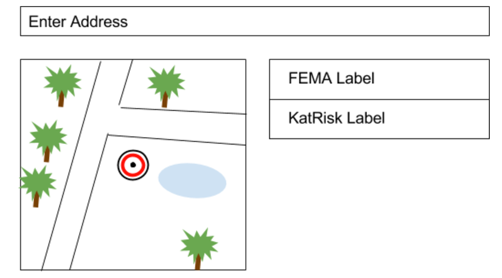

##SpatialKey Software Engineer, Front End - Interview Exercise

Kathy is an Underwriter.  Her job is to assess the risk of a given location, along with other factors, to make decisions about pricing policies. Typically she is only given the address of a location and must manually cross-reference an address against different Risk Modelers maps, one by one, to determine the level of risk. This is done in the browser and across different websites for each Risk Modeler. Since each Risk Modeler has their own methodology for determining the risk, she likes to view the results side by side for comparison, so she copies her findings into a spreadsheet. She also likes to see where the location is on the map to gain confidence in the results.

You are tasked with unifying Kathy’s current process into a single page application. You’ve been given a rough wireframe to give you an idea of what the app might look like. It’s up to you to use it or not. You’ve also got a nearly barebones index.html file to work from. Feel free to add any UI enhancements you think are important for Kathy to get her job done, but make sure you don’t spend all your time moving pixels.

##Wireframe

  
#Requirements
* Must be written in HTML, CSS and JavaScript
* You may use any libraries or frameworks or none at all
* You may use any mapping library of your choice to display the location on the map
* If there are any instructions for building your project or any other details you'd like to elaborate on include your own README (feel free to rename the existing file)
* You must provide an estimated completion date that will be used to schedule your follow up interview, during which you will demo your application
* When you are finished and ready to submit your work push to a new branch on this repository and submit a pull request to the master branch which will notify us and provide a mechanism to review your application and aide the discussion in the followup interview.

##Mocking the API

Included in the barebones index page are 2 stubbed api calls. You'll need to get these updated to be "async" with a time delay, as if it were a real call.

**The values Kathy needs to compare are:**

* sk_risk_fema (For FEMA)
* sk_risk_katrisk (For KatRisk)